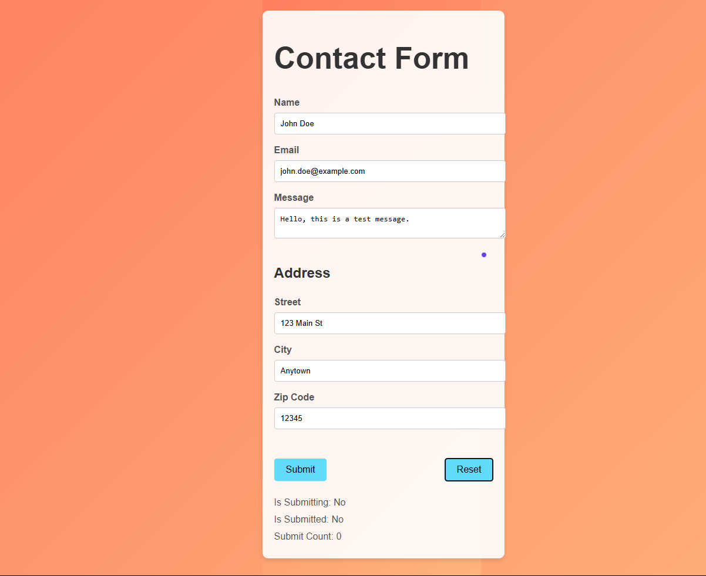
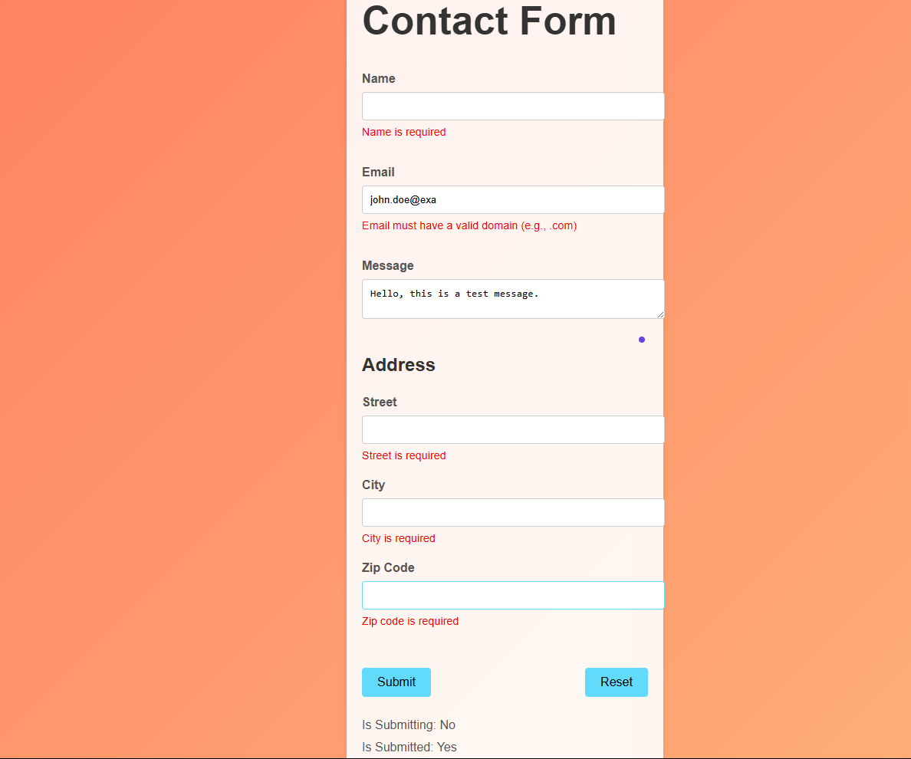
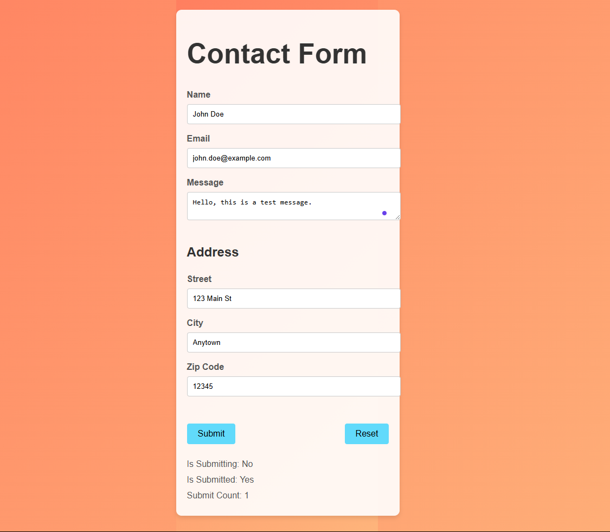

# Contact Form

This comprehensive contact form is built using Vite, TypeScript, and React with the `react-hook-form` library. It includes advanced features such as form submission, validation, custom validation, setting default values, nested objects, touched and dirty states, field values, disabling fields, handling submission errors, disabling form submission, tracking `isSubmitting`, `isSubmitted`, and `submitCount`, resetting the form, using `useEffect()` for side effects, and async validation.  

The UI is designed to be modern and user-friendly with a black background and white text.

## Features
- **Form Submission:** Handles form submission with client-side validation.
- **Validation:** Advanced form validation using `react-hook-form` and `yup`.
- **Custom Validation:** Custom validation rules for specific fields.
- **Default Values:** Pre-populates form fields with default values.
- **Nested Objects:** Manages nested form fields (e.g., address).
- **Touched and Dirty States:** Tracks whether fields have been touched or modified.
- **Field Values:** Manages and displays field values.
- **Disabling Fields:** Disables fields during form submission.
- **Handling Submission Errors:** Displays error messages for invalid form inputs.
- **Disabling Form Submission:** Prevents multiple form submissions.
- **Tracking Form Status:** Tracks `isSubmitting`, `isSubmitted`, and `submitCount`.
- **Resetting the Form:** Allows users to reset the form to default values.
- **Side Effects:** Uses `useEffect()` for additional form management.
- **Async Validation:** Supports asynchronous validation operations.
- **Improved UI Design:** Modern and sleek design with a black background and white text.

## Screenshots
### Form View


### Validation Error


### Successful Submission


## Installation

1. **Clone the repository:**
   ```bash
   git clone https://github.com/ablove/contact-form.git
   cd contact-form
2. Install dependencies:
npm install

3. Start the development server:
npm run dev

## Usage  
- Open your browser and navigate to `http://localhost:5173`.  
- Fill out the form and submit it to see the form data in the console.  
- Test the form submission, including async operations and error handling.  
- Test the form reset functionality.  

## Technologies Used  
- Vite: Fast and efficient build tool.  
- TypeScript: Statically typed superset of JavaScript.  
- React: JavaScript library for building user interfaces.  
- React Hook Form: Advanced form management for React.  
- Yup: Schema builder for validation.  
- CSS: Styling the form and application.  


